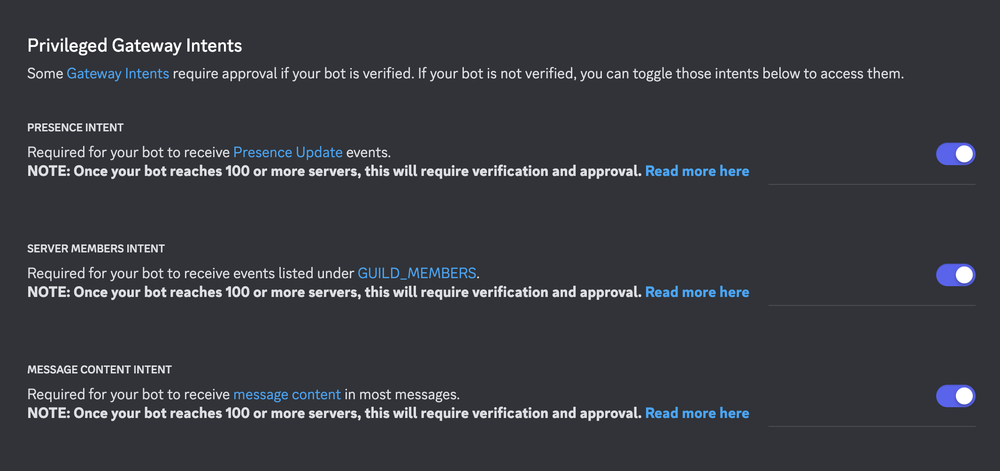

# WeatherBot Setup Guide

Hi there, This Discord bot built using Python and managed with Poetry for virtual environment management. Follow the instructions below to ensure that the bot functions correctly on your system.

### Before you begin, make sure to satisfy the following requirements:
1. **Python Version:** Ensure that Python 3.11 or higher is installed on your system. If you have a different version and encounter issues, you may need to modify the Python version specified in the pyproject.toml file within the weatherBot directory.
2. **Poetry Installation:** If Poetry is not installed on your system, install it by running:
`pip install poetry`
3. **Environment Variables:** You need to set up your Discord bot token and any API keys (if using your keys for WeatherAPI, OpenRouter, etc.) in a .env file located in the weatherBot directory.

### Discord Bot Setup
To set up your Discord bot, follow these steps:

Regarding permissions of Bot in discord
1. Go to the [Discord Developer Portal](https://discord.com/developers/applications) and create a new application.
2. Open the Application and click on bot, Here, you can find and copy your bot token, which you will need to paste into your .env file.
3. Ensure that the necessary bot permissions are enabled. The required toggles can be found in the Bot section under 'Privileged Gateway Intents'. For reference, see the permissions in the image below:
Bot Permissions

## Installation and Running the Bot

1. Open your terminal, navigate to the weatherBot directory and Install the required dependencies using Poetry: `poetry install`.
2. Activate the virtual environment: `poetry shell`
3. Start the bot by running: `python run_bot.py`

Alternatively, if you prefer not to activate the virtual environment, you can directly run the bot with:   `poetry run python run_bot.py`

Upon successful startup, you should see the following message in your terminal:   `INFO:CustomLogger:Bot is ready.`

You are now ready to interact with the WeatherBot in your Discord server!  

#### Please drop me a mail at sakshishinde931@gmail.com if you get face any issue.

## Some Qualities of this Bot.
1. **Selective Response:** The bot intelligently monitors all user conversations but will only respond when a message is directly relevant to its functions, such as weather inquiries, or when explicitly mentioned in the conversation.
2. **Humorous Weather Updates:** When providing weather updates, the bot adopts a humorous tone, adding a touch of light-heartedness to its responses, making daily weather checks more enjoyable.
3. **General Knowledge:** Beyond weather-related questions, the bot is equipped to handle a wide range of general inquiries with the integration of gpt-3.5, ensuring that it can engage effectively with users on various topics.
